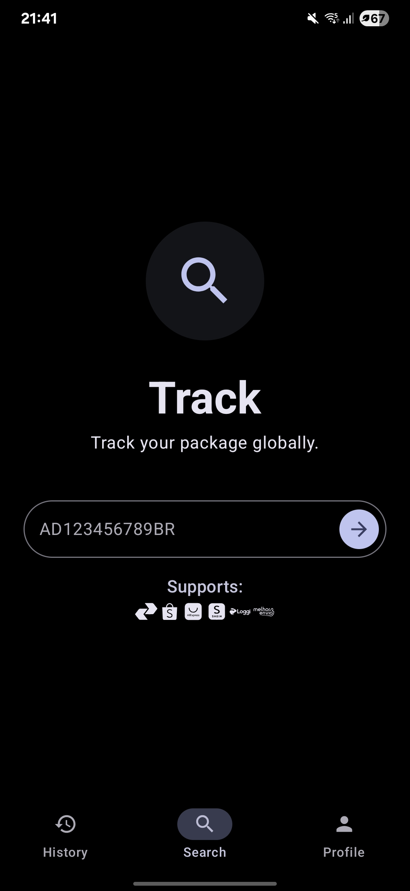
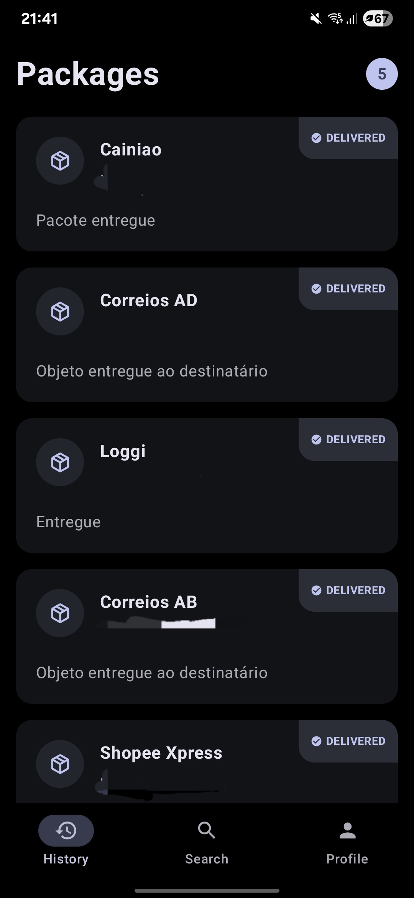
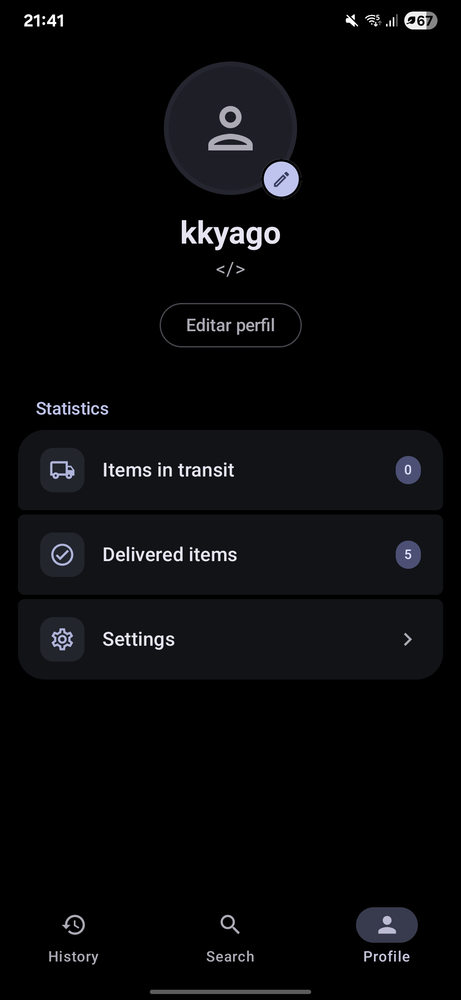

<h1>Kaeru Tracker</h1>

Um rastreador de encomendas para android com tema Material You

<h2 style="margin: 0;"><strong>Disclaimer ⚠</strong></h2>

O **KaeruTrack** é um projeto de código aberto desenvolvido de forma independente por entusiastas. Para evitar quaisquer mal-entendidos, esclarecemos que:

1. **Sem Afiliação:** Este aplicativo **não possui qualquer vínculo, suporte, patrocínio ou afiliação oficial** com os Correios (Empresa Brasileira de Correios e Telégrafos) ou qualquer outra empresa de logística e transportadora mencionada no app.
2. **Propriedade de Marcas:** Todos os nomes de empresas, logotipos e marcas mencionadas são de propriedade de seus respectivos donos. O uso desses nomes serve apenas para fins de identificação de serviços de rastreio.
3. **Uso de Dados:** O app funciona apenas como um agregador, facilitando a visualização de informações que já são públicas nos sites das transportadoras. Não nos responsabilizamos por falhas de entrega, atrasos ou imprecisões nos dados fornecidos pelas empresas de transporte.
4. **Fins Educativos:** O projeto foi desenvolvido com o objetivo de facilitar a experiência do usuário e para fins de aprendizado em desenvolvimento Android.

<h1>Capturas de tela</h1>

<h1>Download abaixo</h1>

<table>
<tr>
<td align="center">
 
</td>
</tr>
</table>

<h1>Sumário</h1>

- [Features](#features)
- [Baixe agora](#download-abaixo)
- [Créditos](#créditos)

<h1>Features</h1>

- Rastreia encomendas de várias [transportadoras](#transportadoras) diferentes
- Material 3
- Customização profunda
- etc.

<h1>Créditos</h1>

A comunidade de código aberto, ferramentas, bibliotecas e APIs que tornam esse projeto possível.

**By [Yago](https://github.com/kkyago)**

